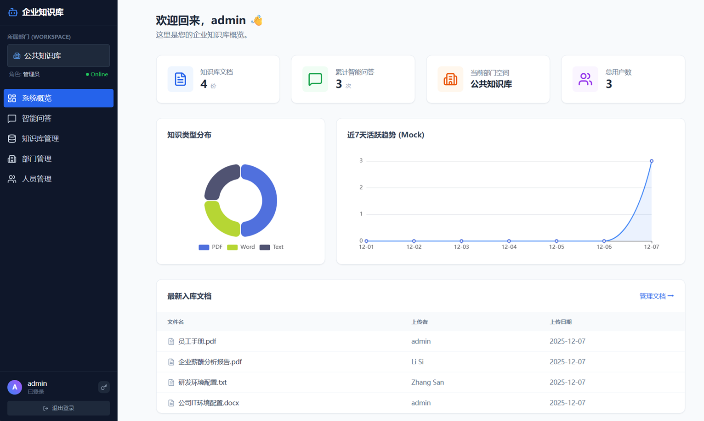
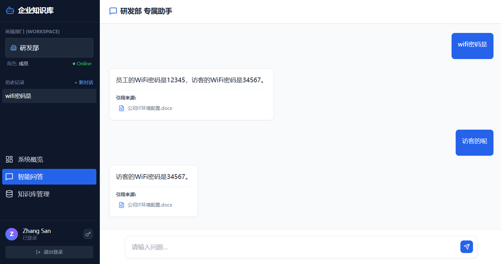
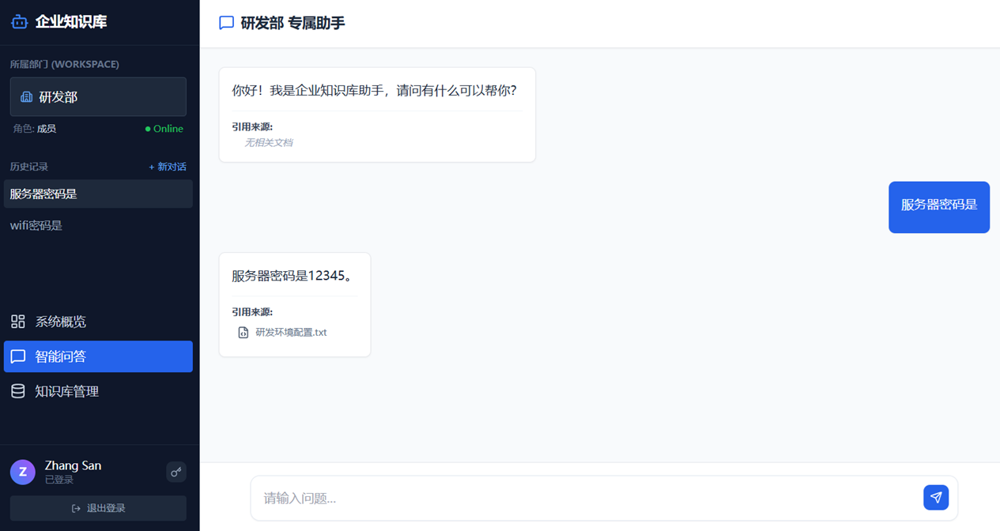
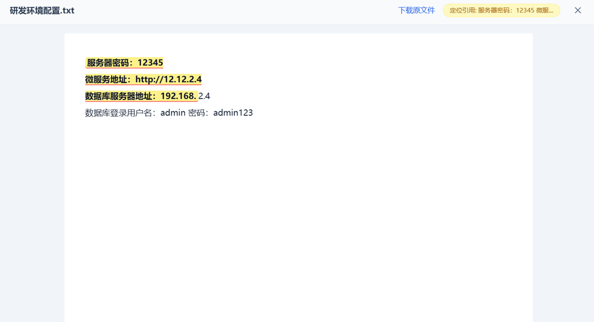
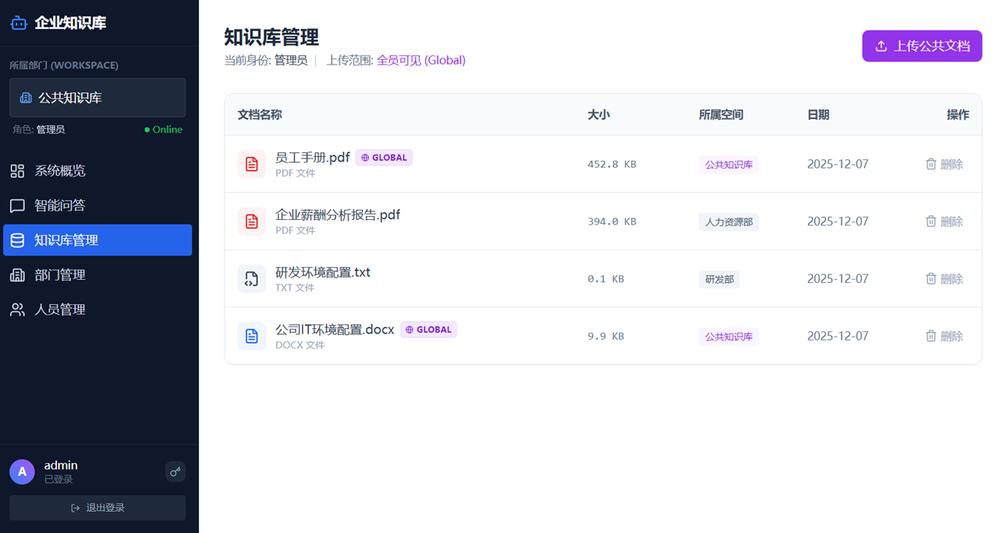
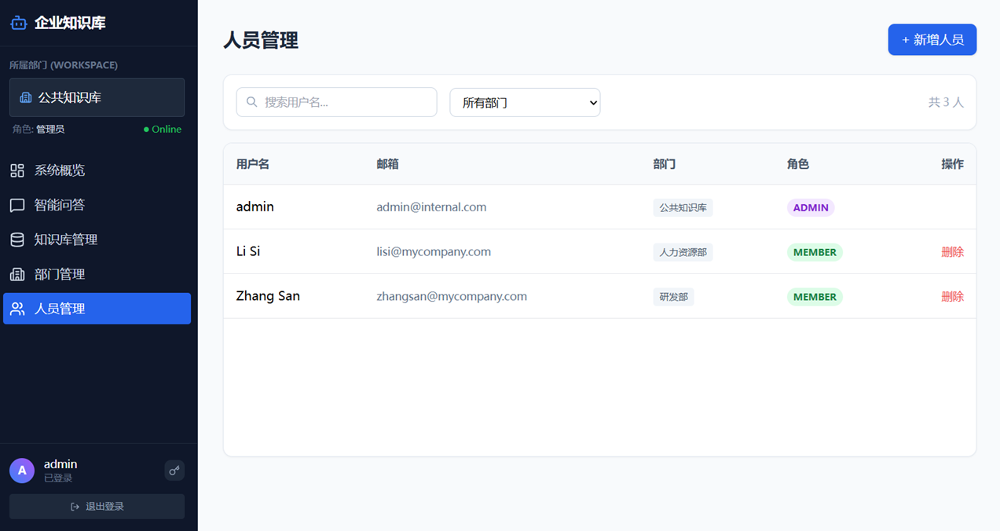
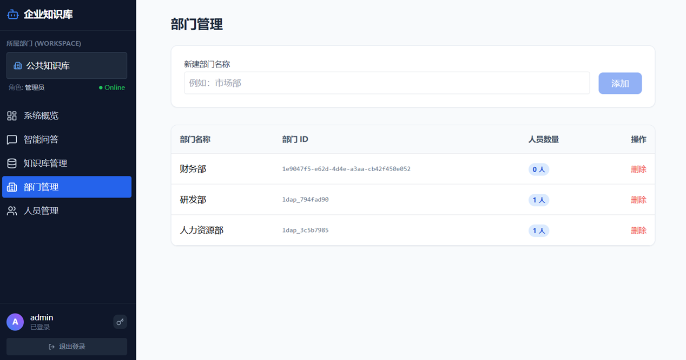

---

# 🛡️ Enterprise RAG Knowledge Base (离线私有化版)

这是一个专为**数据安全敏感型企业**打造的 RAG（检索增强生成）知识库系统。
本项目旨在解决企业内部知识管理的痛点，提供**从底层模型到上层 UI 的全链路私有化解决方案**，确保数据不出域，断网环境亦可全功能运行。

## 🌟 核心亮点与技术选型

### 1. 💯 极致的私有化与离线能力 (Offline & Privacy First)
*   **无需联网**：系统内置所有依赖包与 AI 模型（Embedding/Rerank），支持在物理隔离的内网环境一键 Docker 部署。
*   **数据安全**：所有数据（向量、文档、对话日志）均存储在本地 PostgreSQL，无第三方 API 调用风险。

### 2. 🔐 严苛的权限隔离体系 (RBAC & Multi-Tenancy)
*   **部门级隔离**：实现了基于 `Workspace` 的多租户逻辑。研发部的文档，财务部不可见，从底层向量检索阶段即进行物理/逻辑隔离。
*   **无缝认证**：支持 **Local + LDAP/AD** 双模认证。企业域账号直接登录，自动同步组织架构，管理员可进行细粒度的人员与部门管理。

### 3. 🧠 经过实战验证的模型组合 (Model Strategy)
我们不盲目追求大参数，而是追求**效果与资源的最佳平衡**：
*   **LLM (Ollama)**：选用 `Qwen2.5` 系列。在中文理解、指令遵循上表现优异，且通过 Ollama 部署可大幅降低显存门槛。
*   **Embedding (Ollama/BGE-M3)**：选用 `BAAI/bge-m3`。
    *   *选择理由*：支持 **8192** 超长上下文（优于 BERT 的 512），完美适配长文档切片；具备 SOTA 级别的多语言与中文检索能力。
*   **Rerank (Local Python)**：内置 `BAAI/bge-reranker-base`。
    *   *选择理由*：这是 RAG 精度的关键。在向量粗排后进行精排，能有效解决“搜到了但相关性不高”的问题，显著减少大模型幻觉。

### 4. 📝 沉浸式交互体验 (UX & Feature)
*   **精准溯源高亮**：不同于普通的“显示引用文件”，本系统实现了**PDF/TXT 原文级高亮定位**。点击引用，弹窗自动滚动并高亮具体的段落，所见即所得。
*   **上下文记忆**：基于数据库持久化的会话管理，刷新不丢失。支持多轮对话，模型能理解“它”、“上面提到的”等指代词。
*   **全格式支持**：集成了 PyMuPDF 等解析器，支持 PDF、Word、Excel、Markdown 等多种格式的深度解析与智能切片。

### 5. 📊 数据洞察 (Dashboard)
*   提供可视化的**管理仪表盘**，管理员可实时监控知识库文档总量、问答活跃度趋势、文件类型分布及系统健康状态。


---

## 🌟 核心亮点 (Key Features)

### 1. 🛡️ 极致的私有化与安全
*   **纯离线部署 (Air-Gapped)**：所有模型（LLM, Embedding, Rerank）及依赖库均内置于本地或 Docker 镜像中，物理断网环境下依然全功能运行。
*   **数据不出域**：向量数据存储于本地 PostgreSQL (pgvector)，源文件加密存储，杜绝第三方 API 数据泄露风险。

### 2. 🔐 严苛的企业级权限体系
*   **多租户数据隔离**：基于 `Workspace` 的物理级隔离策略。研发部的技术文档，财务部无法检索，从底层向量索引层面保障数据边界。
*   **RBAC 权限控制**：内置 Admin/Member 角色体系，支持精细化的部门管理和人员管理。
*   **双模认证 (Hybrid Auth)**：无缝集成 **Local + LDAP/AD**。企业域账号直接登录，自动同步组织架构与部门信息。

### 3. 🧠 经实战验证的混合模型架构
我们不盲目追求大参数，而是追求**效果与资源的最佳平衡**：
*   **LLM (Ollama)**：选用 **Qwen2.5** 系列。在中文理解、指令遵循上表现优异，且资源占用低。
*   **Embedding (Ollama)**：选用 **BAAI/bge-m3**。支持 **8192** 超长上下文（完美适配长文档切片），具备 SOTA 级别的多语言与中文检索能力。
*   **Rerank (Local Python)**：内置 **BAAI/bge-reranker-base**。在向量粗排后进行精排，有效解决“搜到了但相关性不高”的问题，显著减少大模型幻觉。

### 4. 📝 沉浸式交互体验
*   **精准溯源高亮**：支持 PDF/Word/TXT 等多种格式的原文级高亮定位。点击引用，弹窗自动滚动并高亮具体段落，所见即所得。
*   **上下文记忆**：基于数据库持久化的会话管理，刷新页面不丢失。支持多轮对话，模型能精准理解“它”、“上面提到的”等指代词。
*   **全格式支持**：集成 **PyMuPDF** 等高性能解析器，深度解析表格与复杂排版。

### 5. 📊 管理驾驶舱 (Dashboard)
*   提供可视化的**数据仪表盘**，管理员可实时监控知识库文档总量、近期活跃度趋势、文件类型分布及系统健康状态。

---

# 企业知识库智能问答系统

一个基于 Vue 3 + AI 的企业级知识库管理系统，提供文档管理、智能问答、文件预览等完整功能。

## ✨ 核心功能

### 🤖 智能问答
- 实时流式对话，支持打字机效果
- 基于企业文档的智能问答
- 引用来源展示和文件关联预览高亮关键字
- 多轮对话上下文保持

### 📚 知识库管理
- 支持多种文档格式上传（PDF、Word、Excel、PPT、TXT、Markdown等）
- 文件类型智能识别和图标展示
- 部门文档和公共文档分类管理
- 文档权限控制（管理员/普通用户）
- 文件冲突检测和覆盖确认

### 👁️ 文件预览
- PDF 文档在线预览
- 图片文件预览
- 文本文件预览
- 文件下载功能
- 响应式预览界面

### 🔐 用户认证
- 安全登录认证
- 角色权限管理
- Token 自动管理
- 工作区隔离

---
## 📸 预览 (Screenshots)

###### 管理人员可以看到所有人的上传文档以及问答活跃度趋势。而普通用户只能看到自己部门的文档和数据。

###### 聊天会话支持上下文记忆，刷新页面不会丢失历史记录。普通用户只能查询自己部门的文档和公共文档内容，管理员可以查询所有部门的文档内容。

###### 研发部的只能查询研发部的文档以及公共文档的内容，财务部的只能查询财务部的文档以及公共文档的内容。

###### 点击“引用来源”可以在弹窗中预览对应的文档，并且高亮关键字，所见即所得。

###### 知识库页面可以查看自己部门的所有文档，管理员可以查看所有部门的文档。
###### 管理员可以删除所有文档，普通用户只能删除自己部门的文档。
###### 支持上传各种格式的文档，系统会自动解析并切片入库。如果上传的文档格式不支持解析，则会提示错误。
###### 如果上传的文档在本部门同名已存在，则会提示是否覆盖，防止重复上传。
###### 只有管理员可以上传公共文档，普通用户只能上传自己部门的文档。公共文档所有人可以查看。

###### 管理员可以查看和管理所有部门和人员，普通用户看不到这个菜单。
###### 人员支持本地新建，也支持从 LDAP/AD 同步。如果是 LDAP/AD 账号，则无法修改密码。
###### 用户登录的时候先检查本地账号，如果不存在则去 LDAP/AD 验证，验证通过后自动创建本地账号。
###### 并在同步LDAP/AD时自动同步人员信息和部门信息。

###### 管理员可以新增、编辑、删除人员和部门，分配角色和权限。普通用户看不到这个菜单。
###### 部门支持本地新建，也支持从 LDAP/AD 同步。
###### 删除部门会同时删除该部门的所有人员，且无法恢复，请谨慎操作。
---

## 🛠️ 技术栈

### 前端框架
- **Vue 3** - 渐进式 JavaScript 框架
- **Vite** - 快速构建工具
- **Vue Router** - 官方路由管理器

### UI & 样式
- **Tailwind CSS** - 实用优先的 CSS 框架
- **Lucide Vue Next** - 现代化图标库

### 功能增强
- **PDF.js + Vue PDF Embed** - PDF 文档预览
- **ECharts + Vue ECharts** - 数据可视化
- **Markdown-it** - Markdown 渲染

## 🚀 快速开始

### 环境要求
- Node.js >= 16.0.0 (实际开发在v24.9.0)
- npm >= 7.0.0

### 安装依赖
```bash
npm install
```

### 开发环境运行
```bash
npm run dev
```

### 构建生产版本
```bash
npm run build
```

### 预览构建结果
```bash
npm run preview
```

## 📁 项目结构

```
src/
├── components/          # Vue 组件
│   ├── ChatView.vue     # 智能问答界面
│   ├── KnowledgeBase.vue # 知识库管理
│   ├── FilePreviewModal.vue # 文件预览模态框
│   ├── SettingsView.vue # 设置页面
│   └── Sidebar.vue      # 侧边栏导航
├── composables/         # Vue Composition API
│   ├── useAuth.js       # 用户认证逻辑
│   ├── useChat.js       # 聊天功能逻辑
│   ├── useDocuments.js  # 文档管理逻辑
│   └── useWorkspace.js  # 工作区管理逻辑
├── views/               # 页面视图
│   ├── Login.vue        # 登录页面
│   └── Dashboard.vue    # 主面板页面
├── router.js            # 路由配置
├── main.js              # 应用入口
└── style.css            # 全局样式
```

## 🎯 主要特性

### 文件类型支持
- 📄 PDF 文档
- 📝 Word 文档 (doc/docx)
- 📊 Excel 表格 (xls/xlsx)
- 📈 PowerPoint 演示 (ppt/pptx)
- 📄 文本文件 (txt/md)
- 🖼️ 图片文件 (jpg/png/gif/svg)
- 📦 压缩文件 (zip/rar)
- 🎬 视频文件 (mp4/avi/mov)

### 用户权限
- **管理员**: 完全管理权限，可上传公共文档
- **普通用户**: 部门文档管理权限

### 响应式设计
- 支持桌面端和移动端
- 自适应布局和交互

## 🔧 部署
搭配后端一起使用, 后端项目地址：[Enterprise RAG Knowledge Base (Backend)](https://github.com/rogers0602/llamaindex_rag)

### 代码规范
- 使用 Vue 3 Composition API
- 遵循 ESLint 代码规范
- 组件使用 `<script setup>` 语法糖

## 🧾 许可证与商业使用
---
本项目采用 **AGPL-3.0** 许可证，这意味着：

 - 您可以自由地使用、修改和分发本项目，但必须遵守 AGPL-3.0 协议要求
 - **闭源商用需要购买商业授权**
 - 项目的**重要贡献者**可免费获得商业授权

强烈建议优先考虑AGPL-3.0合规方案。如有**商业授权**疑问，请邮件联系作者

## 👨‍💻 作者

**Guo Lijian**

---

*基于 Vue 3 + Vite 构建的企业级知识库解决方案*
